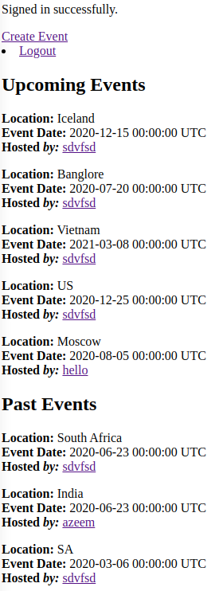

# Private Events

> Create and host a private event

Created with Rails and uses the devise gem for authentication

## Built With

- Ruby on Rails
- Devise Gem

## Getting Started

To get a local copy up and running follow these simple example steps.

### Prerequisites

1. Have ruby installd
2. Have Rails 6 insalled

### Setup

1. Clone this repo to your computer using <code>git clone</code> and the web url
2. Open your terminal and <code>cd</code> into the project root directory
3. Join the private events and post something :smile:

### Install

1. Run <code>bundle install</code>
2. Install yarn packages as the terminal will prompt you to do
3. Run <code>rails db:migrate</code>

### Usage

Open your browser at <code>localhost:3000</code>

## Authors

👤 **Azeem Ahmed**

- Github: [@Azeem838](https://github.com/Azeem838)

👤 Rajkumar Das

- Github: [@rajkumardas2701](https://github.com/rajkumardas2701)
- Twitter: [@Rajkuma58621299](https://twitter.com/Rajkuma58621299)
- Linkedin: [Rajkumar Das](https://www.linkedin.com/in/rajkumar-das-41308961/)

## 🤝 Contributing

Contributions, issues and feature requests are welcome!

Feel free to check the [issues page](https://github.com/Azeem838/re-former/issues).

## Show your support

Give a ⭐️ if you like this project!

## 📝 License

This project is [MIT](lic.url) licensed.
